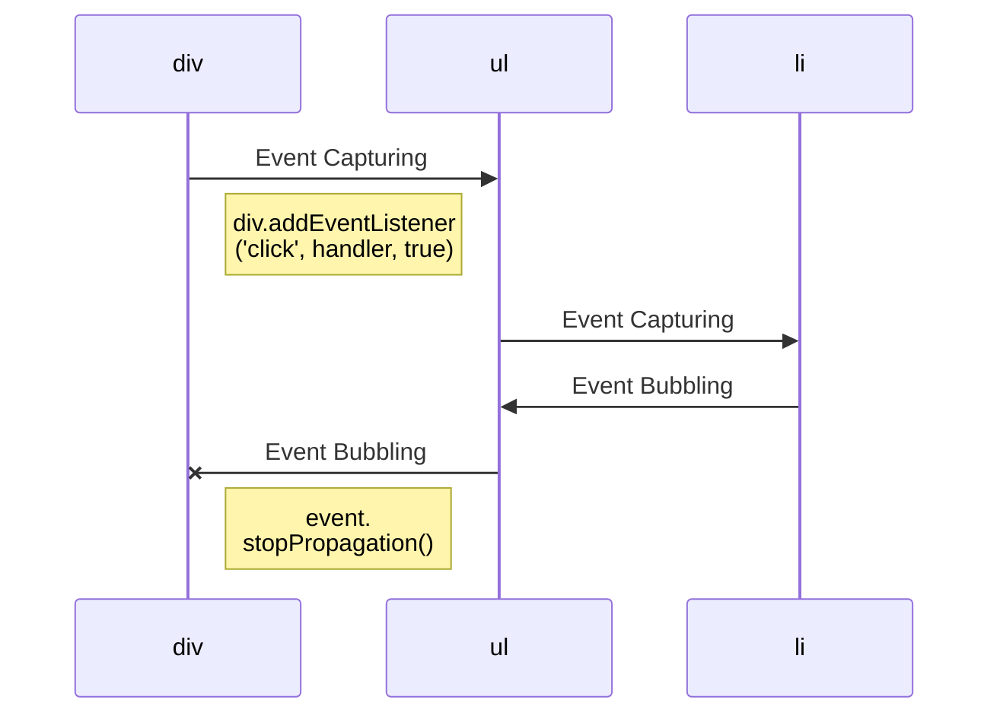

# Javascript Common Questions
 
 1. Event Bubbling & Event Capturing & Event Delegation (eventPhase)

## Function Scope

 - principle of least privilege

```
function foo(a) {
  var b = 2;

  function bar() {
    // ...
  }

  var c = 3;
}

foo(2);

console.log(a); // ReferrenceError
console.log(b); // ReferrenceError
console.log(c); // ReferrenceError

bar(); // ReferrenceError
```
```
function doSomething(a) {
  var b;
  b = a + doSomethingElse(a * 2);

  console.log(b * 3);

  function doSomethingElse(a) {
    return a - 1;
  }
}

doSomething(2); // 15

function doSomethingElse(a) {
  return a - 2;
}
```
