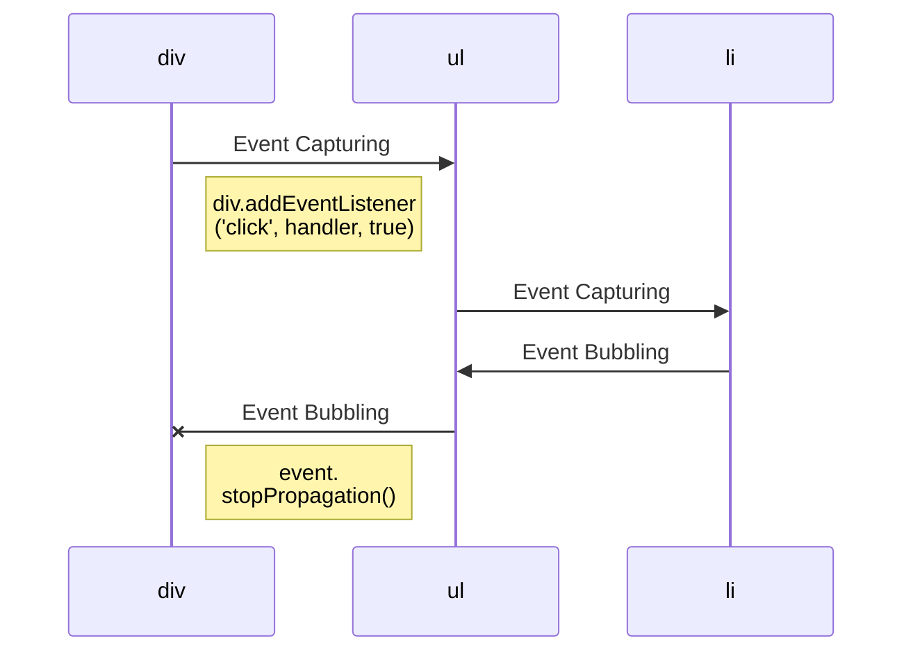

# Javascript Common Questions
 
 1. Event Bubbling & Event Capturing & Event Delegation (eventPhase)

```mermaid
sequenceDiagram
div ->> ul: Event Capturing
Note right of div: div.addEventListener<BR>('click', handler, true)
ul->>li: Event Capturing
li->> ul: Event Bubbling
ul-x div : Event Bubbling
Note right of div: event.<BR>stopPropagation()
```
